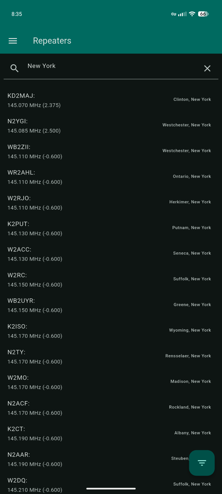
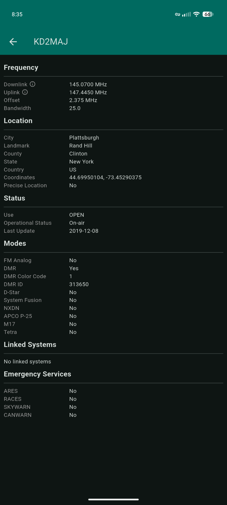
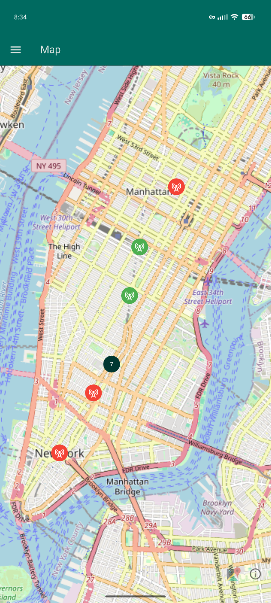

# Open Repeater Map

A free and open source [Repeater Book](https://repeaterbook.com/) interface with
[Open Street Map](https://openstreetmap.org) map tiles.

<div style="display: flex; gap: 10px;">
  
  
  
</div>

## NOTICES

This application is not available on any application store, nor will it be without the prior,
explicit approval of the maintainers of Repeater Book (if you are one of these people, see
[this section](#for-repeater-book-maintainers)).

This has been developed first and foremost for Android as a proof of concept. Flutter offers cross
platform support, so if the application is validated and moves forward, we'll focus up on iOS
support, but for now expect it to look like a debug build on iOS and a prototype on Android.

If this application is published on any application store, it will not ever be a paid application in
any form, it is free as in price and free as in [freedom](./LICENSE).

## Features

Includes a local document containing all of the repeaters found on repeaterbook as of late January,
2026, though it is reasonably compacted to CSV (~3.4 MB). This ensures repeaters are always
available, even while offline.

Uses Open Street Map tiles with local caching for visualizing their locations. This generally
requires an internet connection, though up to 1GB will be cached and replaced as requested by the
Open Street Map provider.

Repeaters on the main list can be searched for by callsign, county, nearest city, or state.

Repeaters on the main list can also be filtered by their operational status, usage retrictions, and
frequency band.

## Build Instructions

Connect Android to computer over USB and enable [USB Debugging](https://developer.android.com/studio/debug/dev-options)

Get device ID with [`adb`](https://developer.android.com/tools/adb):
```bash
adb devices
# List of devices attached
# emulator-5554 device
# ...           device
```

Build [Flutter](https://flutter.dev/) application:

> Replace `device_id` with the device ID above.

```bash
flutter build apk -d device_id --release
```

Install the application:

```bash
adb install ./build/app/outputs/flutter-apk/app-release.apk
```

## For Repeater Book Maintainers

First, thank you for maintaining Repeater Book, it's a super helpful resource as a new ham operator
without many connections to the community yet.

Second, I dont have access to the apple or google app stores on my current phone, nor could I find
the source code for the existing mobile app anywhere. I wrote out this app as a prototype for an
open source version which could operate without location or internet services and could optionally
display repeaters on a map.

Third, if you have the time, I'd love for you to check out this app. Relevant source code is in the
[`./lib`](./lib) directory & data is in [`./data`](./data). Flutter can be tricky to set up but if
you already have an updated mobile development environment it should be fairly straight forward.

Finally, if you're open to making the existing app open source, I would love to spend some time
contributing to it. If you prefer not to, then I'd like to ask for your permission to continue work
on this application, publish it to the respective app stores (ideally, iOS, Google Play, and
F-Droid), and discuss potential for some kind of streamlined feature on the Repeater Book API for =
publishing changes to the Repeater Book. This application will never be monetized in any way, nor
will I impose or attempt to funnel any donations from it, I simply want for this to exist. 

Should you decide against open sourcing your application _and_ against creating some kind of
streamlined system for getting repeater list updates, this application will live here and I will
just periodically update the [CSV file](./data/us-repeaters.csv) of the aggregated repeaters so I
can create local builds for myself or for anyone else who finds this repository. The application
itself does not interact with the Repeater Book directly, so there should be no increased load on
the servers correlated with the number of people running this application.

Thank you for your time. You can reach me through the social platforms listed on
[my website](https://jtriley.com) or on an issue opened on this repository.
